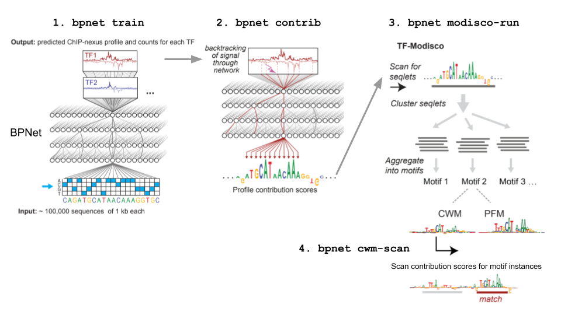
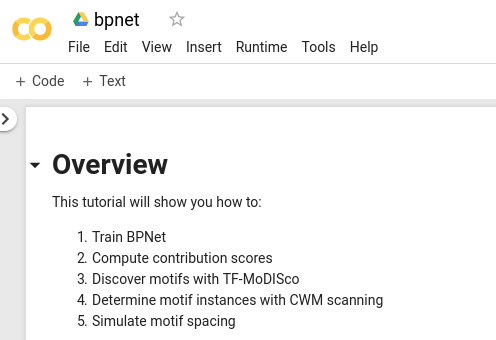

# BPNet
[](https://circleci.com/gh/kundajelab/bpnet)

BPNet is a python package with a CLI to train and interpret base-resolution deep neural networks trained on functional genomics data such as ChIP-nexus or ChIP-seq. It addresses the problem of pinpointing the regulatory elements in the genome:


Specifically, it aims to answer the following questions:
- What are the sequence motifs?
- Where are they located in the genome?
- How do they interact?

For more information, see the BPNet manuscript:

*Deep learning at base-resolution reveals motif syntax of the cis-regulatory code* (http://dx.doi.org/10.1101/737981.)

## Overview



## Getting started

Main documentation of the bpnet package and an end-to-end example higlighting the main features are contained in the following colab notebook **<https://colab.research.google.com/drive/1VNsNBfugPJfJ02LBgvPwj-gPK0L_djsD>**. You can run this notebook yourself by clicking on '**Open in playground**'. Individual cells of this notebook can be executed by pressing the Shift+Enter keyboard shortcut.



To learn more about colab, visit <https://colab.research.google.com> and follow the 'Welcome To Colaboratory' notebook.

## Main commands

Compute data statistics to inform hyper-parameter selection such as choosing to trade off profile vs total count loss (`lambda` hyper-parameter):

```bash
bpnet dataspec-stats dataspec.yml
```

Train a model on BigWig tracks specified in [dataspec.yml](examples/chip-nexus/dataspec.yml) using an existing architecture [bpnet9](bpnet/premade/bpnet9-pyspec.gin) on 200 bp sequences with 6 dilated convolutional layers:

```bash
bpnet train --premade=bpnet9 dataspec.yml --override='seq_width=200;n_dil_layers=6' .
```

Compute contribution scores for regions specified in the `dataspec.yml` file and store them into `contrib.scores.h5`

```bash
bpnet contrib . --method=deeplift contrib.scores.h5
```

Export BigWig tracks containing model predictions and contribution scores

```bash
bpnet export-bw . --regions=intervals.bed --scale-contribution bigwigs/
```

Discover motifs with TF-MoDISco using contribution scores stored in `contrib.scores.h5`, premade configuration [modisco-50k](bpnet/premade/modisco-50k.gin) and restricting the number of seqlets per metacluster to 20k:

```bash
bpnet modisco-run contrib.scores.h5 --premade=modisco-50k --override='TfModiscoWorkflow.max_seqlets_per_metacluster=20000' modisco/
```

Determine motif instances with CWM scanning and store them to `motif-instances.tsv.gz`

```bash
bpnet cwm-scan modisco/ --contrib-file=contrib.scores.h5 modisco/motif-instances.tsv.gz
```

Generate additional reports suitable for ChIP-nexus or ChIP-seq data:

```bash
bpnet chip-nexus-analysis modisco/
```

Note: these commands are also accessible as python functions:
- `bpnet.cli.train.bpnet_train`
- `bpnet.cli.train.dataspec_stats`
- `bpnet.cli.contrib.bpnet_contrib`
- `bpnet.cli.export_bw.bpnet_export_bw`
- `bpnet.cli.modisco.bpnet_modisco_run`
- `bpnet.cli.modisco.cwm_scan`
- `bpnet.cli.modisco.chip_nexus_analysis`

## Main python classes

- `bpnet.seqmodel.SeqModel` - Keras model container specified by implementing output 'heads' and a common 'body'. It contains methods to compute the contribution scores of the input sequence w.r.t. differnet output heads.
- `bpnet.BPNet.BPNetSeqModel` - Wrapper around `SeqModel` consolidating profile and total count predictions into a single output per task. It provides methods to export predictions and contribution scores to BigWig files as well as methods to simulate the spacing between two motifs.
- `bpnet.cli.contrib.ContribFile` - File handle to the HDF5 containing the contribution scores
- `bpnet.modisco.files.ModiscoFile` - File handle to the HDF5 file produced by TF-MoDISco.
  - `bpnet.modisco.core.Pattern` - Object containing the PFM, CWM and optionally the signal footprint
  - `bpnet.modisco.core.Seqlet` - Object containing the seqlet coordinates.
  - `bpnet.modisco.core.StackedSeqletContrib` - Object containing the sequence, contribution scores and raw data at seqlet locations.
- `bpnet.dataspecs.DataSpec` - File handle to the `dataspec.yml` file
- `dfi` - Frequently used alias for a pandas `DataFrame` containing motif instance coordinates produced by `bpnet cwm-scan`. See the [colab notebook](https://colab.research.google.com/drive/1VNsNBfugPJfJ02LBgvPwj-gPK0L_djsD) for the column description.

## Installation

Supported python version is 3.6. After installing anaconda ([download page](https://www.anaconda.com/download/)) or miniconda ([download page](https://conda.io/miniconda.html)), create a new bpnet environment by executing the following code:

```bash
# Clone this repository
git clone git@github.com:kundajelab/bpnet.git
cd bpnet

# create 'bpnet' conda environment
conda env create -f conda-env.yml

# Disable HDF5 file locking to prevent issues with Keras (https://github.com/h5py/h5py/issues/1082)
echo 'export HDF5_USE_FILE_LOCKING=FALSE' >> ~/.bashrc

# Activate the conda environment
source activate bpnet
```

Alternatively, you could also start a fresh conda environment by running the following

```bash
conda env create -n bpnet python=3.6
source activate bpnet
conda install -c bioconda pybedtools bedtools pybigwig pysam genomelake
pip install git+https://github.com/kundajelab/DeepExplain.git
pip install tensorflow~=1.0 # or tensorflow-gpu if you are using a GPU
pip install bpnet
echo 'export HDF5_USE_FILE_LOCKING=FALSE' >> ~/.bashrc
```

When using bpnet from the command line, don't forget to activate the `bpnet` conda environment before:

```bash
# activate the bpnet conda environment
source activate bpnet

# run bpnet
bpnet <command> ...
```

### (Optional) Install `vmtouch` to use `bpnet train --vmtouch`

To use the `--vmtouch` in `bpnet train` command and thereby speed-up data-loading, install [vmtouch](https://hoytech.com/vmtouch/). vmtouch is used to load the bigWig files into system memory cache which allows multiple processes to access
the bigWigs loaded into memory. 

Here's how to build and install vmtouch:

```bash
# ~/bin = directory for localy compiled binaries
mkdir -p ~/bin
cd ~/bin
# Clone and build
git clone https://github.com/hoytech/vmtouch.git vmtouch_src
cd vmtouch_src
make
# Move the binary to ~/bin
cp vmtouch ../
# Add ~/bin to $PATH
echo 'export PATH=$PATH:~/bin' >> ~/.bashrc
```
