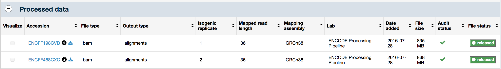
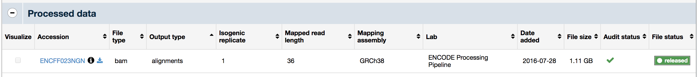
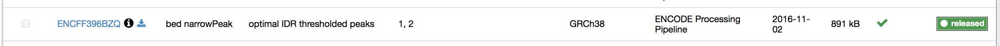
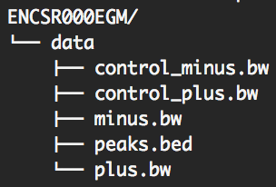
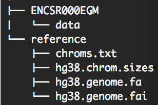

# bpnet-refactor
# BPNet

BPNet is a python package with a CLI to train and interpret base-resolution deep neural networks trained on functional genomics data such as ChIP-nexus or ChIP-seq.

## Installation

### 1. Install Miniconda

Download and install the latest version of Miniconda for your platform. Here is the link for the installers - <a href="https://docs.conda.io/en/latest/miniconda.html">Miniconda Installers</a>

### 2. Create new virtual environment

Create a new virtual environment and activate it as shown below

```
conda create --name bpnet python=3.7
conda activate bpnet
```

### 3. Install basepairmodels

```
pip install git+https://github.com/kundajelab/bpnet-refactor.git

```

### 4. Docker and Anvil options

Instead of installing the BPNet repo by yourself, you can also try the Anvil or Docker options to train/use BPNet models.

**Anvil**

<a href="https://anvil.terra.bio/#workspaces/terra-billing-vir/tf-atlas/workflows">Anvil/Terra </a> 

**Docker**
```
docker pull vivekramalingam/tf-atlas:gcp-modeling_v2.0.0-rc.2

docker run -it --rm --cpus=10 --memory=200g --gpus device=1 --mount src=/mnt/bpnet-models/,target=/mydata,type=bind vivekramalingam/tf-atlas:gcp-modeling_v2.0.0-rc.2

```


## Tutorial on how to use the command line interface

### 1. Experimental dataset

For this tutorial we'll use experimental CHIP-seq data, for the transcription factor CTCF obtained for the K562 cell line, which is available on the ENCODE data portal. There are 5 such experiments that we find in ENCODE, you can see them listed here <a href="https://www.encodeproject.org/search/?type=Experiment&status=released&replicates.library.biosample.donor.organism.scientific_name=Homo+sapiens&biosample_ontology.term_name=K562&assay_title=Histone+ChIP-seq&assay_title=TF+ChIP-seq&target.label=CTCF">CHIP-seq CTCF K562 </a> . We'll restrict ourselves to one experiment 
<a href="https://www.encodeproject.org/experiments/ENCSR000EGM/">ENCSR000EGM</a>

Download the .bam files for the two replicates shown below in the image.



The two replicates are isogenic replicates (biological). A more detailed explanation 
of the various types of replicates can be found <a href="https://www.encodeproject.org/data-standards/terms/">here</a>.

Links to the replicate bam files provided below.

<a href="https://www.encodeproject.org/files/ENCFF198CVB/@@download/ENCFF198CVB.bam">ENCFF198CVB</a>

<a href="https://www.encodeproject.org/files/ENCFF488CXC/@@download/ENCFF488CXC.bam">ENCFF488CXC</a>

```
wget https://www.encodeproject.org/files/ENCFF198CVB/@@download/ENCFF198CVB.bam -O rep1.bam
wget https://www.encodeproject.org/files/ENCFF488CXC/@@download/ENCFF488CXC.bam -O rep2.bam
```

Now download the control for the experiment, which is available here <a href="https://www.encodeproject.org/experiments/ENCSR000EHI/">ENCSR000EHI</a>

Download the bam file shown in the image below.



Link provided below

<a href="https://www.encodeproject.org/files/ENCFF023NGN/@@download/ENCFF023NGN.bam">ENCFF023NGN</a>

```
wget https://www.encodeproject.org/files/ENCFF023NGN/@@download/ENCFF023NGN.bam -O control.bam
```

Finally, download the reference files. In the example below, some preprocessing is required to filter out unwanted chromosomes from the 
`hg38.chrom.sizes` file. Additionally, the blacklist file shown is specific to hg38, and should be replaced with a genome-specific blacklist
if alternative genomes are used.

```
# download genome refrence
wget https://www.encodeproject.org/files/GRCh38_no_alt_analysis_set_GCA_000001405.15/@@download/GRCh38_no_alt_analysis_set_GCA_000001405.15.fasta.gz \
-O hg38.genome.fa.gz | gunzip

# index genome reference
samtools faidx hg38.genome.fa

# download chrom sizes
wget https://www.encodeproject.org/files/GRCh38_EBV.chrom.sizes/@@download/GRCh38_EBV.chrom.sizes.tsv

# exclude alt contigs and chrEBV
grep -v -e '_' -e 'chrEBV' GRCh38_EBV.chrom.sizes.tsv > hg38.chrom.sizes
rm GRCh38_EBV.chrom.sizes.tsv

# make file with chromosomes only
awk '{print $1}' hg38.chrom.sizes > chroms.txt

# download blacklist
wget https://www.encodeproject.org/files/ENCFF356LFX/@@download/ENCFF356LFX.bed.gz -O blacklist.bed.gz
gunzip blacklist.bed.gz
```  

#### 1.1 Preprocessing steps to generate bigwig counts tracks

For the following steps you will need `samtools` `bamtools` and `bedGraphToBigWig`, which are not 
installed as part of this repository. 

The tools can be installed via the links below or using `conda`.

<a href="http://www.htslib.org/download/">samtools</a>

<a href="https://anaconda.org/bioconda/bamtools">bamtools</a>

<a href="http://hgdownload.soe.ucsc.edu/admin/exe/linux.x86_64/">bedGraphToBigWig (Linux 64-bit)</a>

<a href="http://hgdownload.soe.ucsc.edu/admin/exe/macOSX.x86_64/">bedGraphToBigWig (Mac OSX 10.14.6)</a>

```
conda install -c conda-forge -c bioconda samtools=1.19.2 bamtools=2.5.2 ucsc-bedgraphtobigwig=445
```

##### 1.1.1 Merge the two replicates and create and index

```
samtools merge -f merged.bam rep1.bam rep2.bam
samtools index merged.bam
```

We will also index the control BAM file

```
samtools index control.bam
```

##### 1.1.2 Create bigwig files using bedtools via intermediate bedGraph files

In addition to creating the bigwig files, at this step we will filter the bam files
to keep only the chromosomes that we want to use in the model. In the example shown below, 
we do this using `samtools view` and the `hg38.chrom.sizes` reference file.

**Experiment**
```
# get coverage of 5’ positions of the plus strand
samtools view -b merged.bam $(cut -f 1 hg38.chrom.sizes) | \
	bedtools genomecov -5 -bg -strand + -ibam stdin | \
	sort -k1,1 -k2,2n > plus.bedGraph

# get coverage of 5’ positions of the minus strand
samtools view -b merged.bam $(cut -f 1 hg38.chrom.sizes) | \
        bedtools genomecov -5 -bg -strand - -ibam stdin | \
        sort -k1,1 -k2,2n > minus.bedGraph

# Convert bedGraph files to bigWig files
bedGraphToBigWig plus.bedGraph hg38.chrom.sizes plus.bw
bedGraphToBigWig minus.bedGraph hg38.chrom.sizes minus.bw
```
**Control**
```
# get coverage of 5’ positions of the control plus strand
samtools view -b control.bam $(cut -f 1 hg38.chrom.sizes) | \
        bedtools genomecov -5 -bg -strand + -ibam stdin | \
        sort -k1,1 -k2,2n > control_plus.bedGraph

# get coverage of 5' positions of the control minus strand
samtools view -b control.bam $(cut -f 1 hg38.chrom.sizes) | \
        bedtools genomecov -5 -bg -strand - -ibam stdin | \
        sort -k1,1 -k2,2n > control_minus.bedGraph

# Convert bedGraph files to bigWig files
bedGraphToBigWig control_plus.bedGraph hg38.chrom.sizes control_plus.bw
bedGraphToBigWig control_minus.bedGraph hg38.chrom.sizes control_minus.bw
```

#### 1.2 Identify peaks

For the purposes of this tutorial we will use the optimal IDR thresholded peaks that are already available in the ENCODE data portal. We will use the the narrowPeak files that are in BED6+4 format. Explanation of what each of the 10 fields means can be found  <a href="http://genome.ucsc.edu/FAQ/FAQformat.html#format12">here</a>. Currently, only this format is supported but in the
future support for more formats will be added.

See image below that shows the file listed in the ENCODE data portal



Download the file: 
```
wget https://www.encodeproject.org/files/ENCFF396BZQ/@@download/ENCFF396BZQ.bed.gz -O peaks.bed
```


#### 1.3 Organize you data

At this point, we suggest creating a directory structure to store the data, models, predictions, metrics, importance 
scores, discovered motifs, plots & visualizations etc. that will make it easier for you to organize and maintain your work. Let's start by creating a parent directory for the experiment and moving the bigwig files and peaks file from section 1.1 & 1.2 to a data directory
```
mkdir ENCSR000EGM
mkdir ENCSR000EGM/data
mv *.bw ENCSR000EGM/data
mv peaks.bed ENCSR000EGM/data
```

Once this is done, your directory hierarchy should resemble this

<div align="left"></div>

Note that the relative paths in subsequent pipeline steps assume that the current working directory is the one 
immediately above the project directory. For example, if you are in the `ENCSR000EGM` folder, navigate up one level with `cd ..`.

Make a `reference` directory at the same level as the `ENCSR000EGM` experiment directory. In the `reference` directory we will place 4 files: the genome reference `hg38.genome.fa`, the indexed reference `hg38.genome.fai`, the chromosome sizes file `hg38.chrom.sizes` and one text file that contains a list of chromosomes we care about `chroms.txt`. 

```
mkdir ENCSR000EGM/reference 
mv hg38.genome.fa* ENCSR000EGM/reference
mv hg38.chrom.sizes ENCSR000EGM/refence
mv chroms.txt ENCSR000EGM/reference
mv blacklist.bed ENCSR000EGM/reference
```

The directory structure should look like this (TODO: update this image):

<div align="left"></img>
</div>

#### 1.4 Outlier removal

Filter the peaks file for outliers. Peaks that meet either of two criteria are removed:

(1) Overlap with regions identified in `blacklist.bed`.
(2) Number of reads in the peak is in the `--quantile` quantile. 

First prepare a file `input_outliers.json` as shown below:

```
{
    "0": {
        "signal": {
            "source": ["ENCSR000EGM/data/plus.bw",
                       "ENCSR000EGM/data/minus.bw"]
        },
        "loci": {
            "source": ["ENCSR000EGM/data/peaks.bed"]
        },
        "bias": {
            "source": ["ENCSR000EGM/data/control_plus.bw",
                       "ENCSR000EGM/data/control_minus.bw"],
            "smoothing": [null, null]
        }
    }
}
```
Next, run the following command:

```
bpnet-outliers \
    --input-data input_outliers.json  \
    --quantile 0.99 \
    --quantile-value-scale-factor 1.2 \
    --task 0 \
    --chrom-sizes ENCSR000EGM/reference/hg38.chrom.sizes \
    --chroms $(paste -s -d ' ' ENCSR000EGM/reference/chroms.txt) \
    --sequence-len 1000 \
    --blacklist ENCSR000EGM/reference/blacklist.bed \
    --global-sample-weight 1.0 \
    --output-bed ENCSR000EGM/data/peaks_inliers.bed
```

#### 1.5 gc matched negatives

<TODO: a little more detail about what this step does would be useful. Also, I think the code needs to be added to the 
repo?>

```
python get_genomewide_gc_bins.py \
        --ref_fasta reference/hg38.genome.fa \
        --chrom_sizes reference/hg38.chrom.sizes \
        --out_prefix reference/genomewide_gc_stride_1000_flank_size_1057.gc.bed \
        --inputlen 2114 \
        --stride 1000
    
python get_gc_content.py \
       --input_bed ENCSR000EGM/data/peaks_inliers.bed \
       --ref_fasta reference/hg38.genome.fa \
       --out_prefix ENCSR000EGM/data/gc.bed \
       --flank_size 1057

bedtools intersect -v -a \
    reference/genomewide_gc_stride_1000_flank_size_1057.gc.bed \
    -b ENCSR000EGM/data/peaks_inliers.bed > ENCSR000EGM/data/candidate_negatives.tsv

python get_gc_matched_negatives.py \
        --candidate_negatives ENCSR000EGM/data/candidate_negatives.tsv \
        --foreground_gc_bed  ENCSR000EGM/data/gc.bed \
        --output_prefix ENCSR000EGM/data/negatives \
        --neg_to_pos_ratio_train 4     
```


### 2. Train a model!

Before we start training, we need to compile a json file that contains information about the input data. We will call this file `input_data.json`. Here is a sample json file that shows how to specify the input data information for the data we organized in Section 1.3. The data is organized into tasks and tracks. In this example we have one task and two tracks, the plus and the minus strand. Each task has 4 required keys, with values corresponding to tracks calculated in the preprocessing steps:

`signal`: the `plus` and `minus` bigwig tracks 

`loci`: the bed file with the filtered peaks

`background_loci`: the bed file with gc-matched background regions (`source`), and the ratio of positive-to-negative regions used when generating the gc-matched negatives file, expressed as a decimal (`ratio`) 

`bias`: the `plus` and `minus` control bigwig tracks

Note that the `input_data.json` file is used for multiple downstream steps.

```
{
    "0": {
        "signal": {
            "source": ["ENCSR000EGM/data/plus.bw", 
                       "ENCSR000EGM/data/minus.bw"]
        },
        "loci": {
            "source": ["ENCSR000EGM/data/peaks_inliers.bed"]
        },
        "background_loci": {
            "source": ["ENCSR000EGM/data/negatives.bed"],
            "ratio": [0.25]
        },
        "bias": {
            "source": ["ENCSR000EGM/data/control_plus.bw",
                       "ENCSR000EGM/data/control_minus.bw"],
            "smoothing": [null, null]
        }
    }
}
```

Additionally, we need a json file to specify parameters for the BPNet architecture. Let's call this json file
`bpnet_params.json` 

```
{
    "input_len": 2114,
    "output_profile_len": 1000,
    "motif_module_params": {
        "filters": [64],
        "kernel_sizes": [21],
        "padding": "valid"
    },
    "syntax_module_params": {
        "num_dilation_layers": 8,
        "filters": 64,
        "kernel_size": 3,
        "padding": "valid",
        "pre_activation_residual_unit": true
    },
    "profile_head_params": {
        "filters": 1,
        "kernel_size":  75,
        "padding": "valid"
    },
    "counts_head_params": {
        "units": [1],
        "dropouts": [0.0],
        "activations": ["linear"]
    },
    "profile_bias_module_params": {
        "kernel_sizes": [1]
    },
    "counts_bias_module_params": {
    },
    "use_attribution_prior": false,
    "attribution_prior_params": {
        "frequency_limit": 150,
        "limit_softness": 0.2,
        "grad_smooth_sigma": 3,
        "profile_grad_loss_weight": 200,
        "counts_grad_loss_weight": 100        
    },
    "loss_weights": [1, 42],
    "counts_loss": "MSE"
}
```

The `loss_weights` field has two values: the `profile` loss weight and the 
`counts` loss weight. The counts loss weight can be automatically generated 
using the following command:

```
bpnet-counts-loss-weight --input-data input_data.json
```

Finally, we will make the `splits.json` file, which contains information about the chromosomes that are used for 
validation and test. Here is a sample that contains one split.

```
{
    "0": {
        "test":
            ["chr7", "chr13", "chr17", "chr19", "chr21", "chrX"],
        "val":
            ["chr10", "chr18"],
        "train":
            ["chr1", "chr2", "chr3", "chr4", "chr5", "chr6", "chr8", "chr9", "chr11", "chr12", "chr14", "chr15", "chr16", "chr21", "chr22", "chrY"]
    }
}
```

Now that we have our data prepped, we can train our first model!!

The command to train a model is called `train`. 

You can kick start the training process by executing this command in your shell

```
BASE_DIR=ENCSR000EGM
DATA_DIR=$BASE_DIR/data
MODEL_DIR=$BASE_DIR/models
REFERENCE_DIR=reference
CHROM_SIZES=$REFERENCE_DIR/hg38.chrom.sizes
REFERENCE_GENOME=$REFERENCE_DIR/hg38.genome.fa
CV_SPLITS=$BASE_DIR/splits.json
INPUT_DATA=$BASE_DIR/input_data.json
MODEL_PARAMS=$BASE_DIR/bpnet_params.json


mkdir $MODEL_DIR
bpnet-train \
        --input-data $INPUT_DATA \
        --output-dir $MODEL_DIR \
        --reference-genome $REFERENCE_GENOME \
        --chroms $(paste -s -d ' ' $REFERENCE_DIR/chroms.txt) \
        --chrom-sizes $CHROM_SIZES \
        --splits $CV_SPLITS \
        --model-arch-name BPNet \
        --model-arch-params-json $MODEL_PARAMS \
        --sequence-generator-name BPNet \
        --model-output-filename model \
        --input-seq-len 2114 \
        --output-len 1000 \
        --shuffle \
        --threads 10 \
        --epochs 100 \
	--batch-size 64 \
	--reverse-complement-augmentation \
	--early-stopping-patience 10 \
	--reduce-lr-on-plateau-patience 10 \
        --learning-rate 0.004
```

Note: It might take a few minutes for the training to begin once the above command has been issued, be patient and you should see the training eventually start. 

### 3. Predict on test set

Once the training is complete we can generate predictions on the test chromosome.

```
PREDICTIONS_DIR=$BASE_DIR/predictions_and_metrics
mkdir $PREDICTIONS_DIR
bpnet-predict \
        --model $MODEL_DIR/model_split000 \
        --chrom-sizes $CHROM_SIZES \
        --chroms chr1 \
        --reference-genome $REFERENCE_GENOME \
        --output-dir $PREDICTIONS_DIR \
        --input-data $INPUT_DATA \
        --sequence-generator-name BPNet \
        --input-seq-len 2114 \
        --output-len 1000 \
        --output-window-size 1000 \
        --batch-size 64 \
        --threads 2 \
        --generate-predicted-profile-bigWigs
```

This script will output test metrics and also output bigwig tracks if the 
`--generate-predicted-profile-bigWigs` is specified

### 4. Compute importance scores

```
SHAP_DIR=$BASE_DIR/shap
mkdir $SHAP_DIR
bpnet-shap \
        --reference-genome $REFERENCE_GENOME \
        --model $MODEL_DIR/model_split000  \
        --bed-file $DATA_DIR/peaks_med.bed \
        --chroms chr1 \
        --output-dir $SHAP_DIR \
        --input-seq-len 2114 \
        --control-len 1000 \
        --task-id 0 \
        --input-data $INPUT_DATA 
```

### 5. Discover motifs with TF-modisco

```
Use the newer version of TF-modisco called modisco-lite to discover the motifs. Support to directly use modisco-lite from the BPNet repo will be added later.
```
